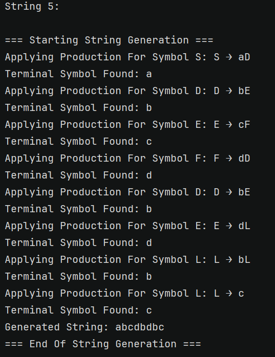
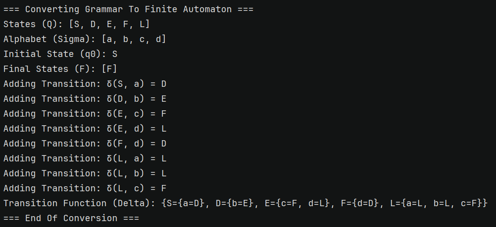
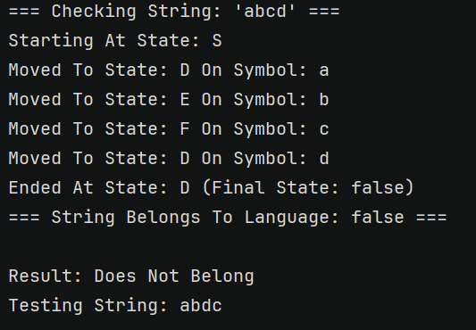
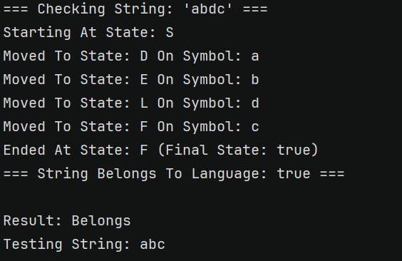

# Laboratory Work #1: Intro to formal languages. Regular grammars. Finite Automata.

### Course: Formal Languages & Finite Automata
### Author: Daniela Cebotari, FAF-231
### Variant: 7


----

## Theory


A **formal language** is basically a collection of strings that follow a specific set of rules. These rules ensure that only certain combinations of symbols are considered valid, kind of like how grammar works in human languages.

The **alphabet (`VT`)** is just the set of symbols that can be used to form these strings. If the alphabet is `{a, b, c, d}`, then any valid string in the language has to be made up of these letters.

The **grammar (`P`)** is what defines how symbols can be put together. It’s a set of production rules, like `S → aD`, which means that wherever there’s an `S`, we can replace it with `aD`. This process continues until we get a valid string.

There are two types of symbols in grammar:
- **Non-terminal symbols (`VN`)**: These are placeholders that still need to be replaced with something else (like `S`, `D`, `E` in my example).
- **Terminal symbols (`VT`)**: These are the actual characters that appear in the final string (like `a`, `b`, `c`, `d`). Once we reach only terminal symbols, we have a complete string.

The **start symbol (`S`)** is where the string generation begins. 

A **finite automaton** is a system that checks whether a given string is valid according to the language’s rules. It is like a machine that reads input, moves between different states, and decides if the input string belongs to the language or not. It consists of:
- **States (`Q`)**: The different conditions the automaton can be in at any moment.
- **Alphabet (`Σ`)**: The input symbols it can read (same as `VT`).
- **Transition function (`δ`)**: The set of rules that determine how the automaton moves from one state to another based on the input.
- **Initial state (`q0`)**: The starting point of the automaton (same as `S`).
- **Final states (`F`)**: If the automaton ends in one of these states after reading the input, the string is accepted.

**String generation** is when we take the grammar rules and apply them step by step to form a valid string. For example:  
`S → aD → abE → abcF → abcdD` (each step replaces a non-terminal until we get a complete string).

**String validation**, on the other hand, is checking if a string follows the rules by running it through the automaton. If we end in a final state, the string is good; otherwise, it’s not part of the language.

---

## Objectives:

* Implementing a type/class for the grammar;
* Adding one function that would generate 5 valid strings from the language expressed by given grammar;
* Implementing some functionality that would convert and object of type src.Grammar to one of type Finite Automaton;
* For the Finite Automaton, adding a method that checks if an input string can be obtained via the state transition from it;

My variant's grammar:

Variant 7:
<br>VN={S, D, E, F, L},
<br>VT={a, b, c, d},
<br>P={
<br>S → aD
<br>D → bE
<br>E → cF
<br>F → dD
<br>E → dL
<br>L → aL
<br>L → bL
<br>L → c
<br>}

## Implementation description

### Grammar Class

* Fields

These fields define the components of the grammar. VN stores non-terminal symbols like S, D, and E, which can be replaced by other symbols. VT contains terminal symbols like a, b, and c, which form the final strings. P maps non-terminals to their production rules, and S is the start symbol, the entry point for generating strings.
```java
private final Set<Character> VN; // Non-terminal symbols
private final Set<Character> VT; // Terminal symbols
private final Map<Character, List<String>> P; // Production rules
private final Character S; // Start symbol
```
* Constructor

The constructor initializes the grammar with the provided components. It assigns the non-terminals (VN), terminals (VT), production rules (P), and start symbol (S) to the corresponding fields, setting up the grammar for use.
```java
public Grammar(Set<Character> VN, Set<Character> VT, Map<Character, List<String>> P, Character S) {
    this.VN = VN;
    this.VT = VT;
    this.P = P;
    this.S = S;
}
```

* String Generation

This method generates a valid string by calling the helper method with the start symbol S. It prints the start and end of the process, along with the generated string, making it easy to track the generation steps.
```java
public String generateString() {
    System.out.println("\n=== Starting String Generation ===");
    String result = generateStringHelper(S);
    System.out.println("Generated String: " + result);
    System.out.println("=== End Of String Generation ===\n");
    return result;
}
```

* Helper Method for String Generation

This helper method recursively generates strings by applying production rules. If the symbol is a terminal, it’s added to the result. For non-terminals, it randomly selects a production rule and processes each symbol in the rule, building the final string step by step.

```java
private String generateStringHelper(Character symbol) {
    if (VT.contains(symbol)) {
        System.out.println("Terminal Symbol Found: " + symbol);
        return symbol.toString();
    }

    List<String> productions = P.get(symbol);
    if (productions == null || productions.isEmpty()) {
        System.out.println("No Productions Found For Symbol: " + symbol);
        return "";
    }

    String production = productions.get(new Random().nextInt(productions.size()));
    System.out.println("Applying Production For Symbol " + symbol + ": " + symbol + " → " + production);

    StringBuilder result = new StringBuilder();
    for (char c : production.toCharArray()) {
        result.append(generateStringHelper(c));
    }

    return result.toString();
}
```

* Grammar to Finite Automaton Conversion

This method converts the grammar into a finite automaton. It defines states (Q), alphabet (Sigma), transitions (delta), initial state (q0), and final states (F). It builds the transition function by iterating through the production rules, adding transitions for each rule.
```java
public FiniteAutomaton toFiniteAutomaton() {
    System.out.println("\n=== Converting Grammar To Finite Automaton ===");

    Set<Character> Q = new HashSet<>(VN); // States
    Q.add('F'); // Add an additional final state
    System.out.println("States (Q): " + Q);

    Set<Character> Sigma = new HashSet<>(VT); // Alphabet
    System.out.println("Alphabet (Sigma): " + Sigma);

    Map<Character, Map<Character, Character>> delta = new HashMap<>(); // Transition function
    Character q0 = S; // Initial state
    Set<Character> F = new HashSet<>(Collections.singletonList('F')); // Final states
    System.out.println("Initial State (q0): " + q0);
    System.out.println("Final States (F): " + F);

    for (Map.Entry<Character, List<String>> entry : P.entrySet()) {
        Character fromState = entry.getKey();
        for (String production : entry.getValue()) {
            if (production.length() == 1 && VT.contains(production.charAt(0))) {
                delta.computeIfAbsent(fromState, k -> new HashMap<>())
                     .put(production.charAt(0), 'F');
                System.out.println("Adding Transition: δ(" + fromState + ", " + production.charAt(0) + ") = F");
            } else if (production.length() > 1) {
                delta.computeIfAbsent(fromState, k -> new HashMap<>())
                     .put(production.charAt(0), production.charAt(1));
                System.out.println("Adding Transition: δ(" + fromState + ", " + production.charAt(0) + ") = " + production.charAt(1));
            }
        }
    }

    System.out.println("Transition Function (Delta): " + delta);
    System.out.println("=== End Of Conversion ===\n");
    return new FiniteAutomaton(Q, Sigma, delta, q0, F);
}
```
### FiniteAutomaton Class

* Fields

These fields define the finite automaton. Q contains all states, Sigma is the alphabet, delta defines the transitions, q0 is the initial state, and F contains the final states used to accept valid strings.
```java
private final Set<Character> Q; // States
private final Set<Character> Sigma; // Alphabet
private final Map<Character, Map<Character, Character>> delta; // Transition function
private final Character q0; // Initial state
private final Set<Character> F; // Final states
```

* Constructor

The constructor initializes the automaton with the provided states, alphabet, transition function, initial state, and final states. This sets up the automaton for string validation.
```java
public FiniteAutomaton(Set<Character> Q, Set<Character> Sigma, Map<Character, Map<Character, Character>> delta, Character q0, Set<Character> F) {
    this.Q = Q;
    this.Sigma = Sigma;
    this.delta = delta;
    this.q0 = q0;
    this.F = F;
}
```

* String Validation

This method checks if a string belongs to the language recognized by the automaton. It starts at the initial state and processes each symbol in the string, following the transitions. If it ends in a final state, the string is accepted; otherwise, it’s rejected.
```java
public boolean stringBelongToLanguage(final String inputString) {
    System.out.println("\n=== Checking String: '" + inputString + "' ===");

    Character currentState = q0;
    System.out.println("Starting At State: " + currentState);

    for (char c : inputString.toCharArray()) {
        if (!delta.containsKey(currentState)) {
            System.out.println("No Transitions Found From State: " + currentState);
            System.out.println("=== String Does Not Belong To Language ===\n");
            return false;
        }

        Map<Character, Character> transitions = delta.get(currentState);
        if (!transitions.containsKey(c)) {
            System.out.println("No Transition Found For Symbol '" + c + "' From State: " + currentState);
            System.out.println("=== String Does Not Belong To Language ===\n");
            return false;
        }

        currentState = transitions.get(c);
        System.out.println("Moved To State: " + currentState + " On Symbol: " + c);
    }

    boolean isFinalState = F.contains(currentState);
    System.out.println("Ended At State: " + currentState + " (Final State: " + isFinalState + ")");
    System.out.println("=== String Belongs To Language: " + isFinalState + " ===\n");
    return isFinalState;
}
```

### Main Class

* Grammar Creation

This part defines the grammar components: non-terminals (VN), terminals (VT), production rules (P), and start symbol (S). It then creates a Grammar object using these components.
```java
Set<Character> VN = new HashSet<>(Arrays.asList('S', 'D', 'E', 'F', 'L'));
Set<Character> VT = new HashSet<>(Arrays.asList('a', 'b', 'c', 'd'));
Map<Character, List<String>> P = new HashMap<>();
P.put('S', Arrays.asList("aD"));
P.put('D', Arrays.asList("bE"));
P.put('E', Arrays.asList("cF", "dL"));
P.put('F', Arrays.asList("dD"));
P.put('L', Arrays.asList("aL", "bL", "c"));
Character S = 'S';

System.out.println("=== Creating Grammar ===");
Grammar grammar = new Grammar(VN, VT, P, S);
```

* String Generation

This snippet generates five valid strings using the generateString() method. Each string is printed to the console, showing examples of strings that follow the grammar rules.
```java
System.out.println("\n=== Generating 5 Valid Strings ===");
for (int i = 0; i < 5; i++) {
    System.out.println("String " + (i + 1) + ":");
    grammar.generateString();
}
```

* Grammar to Finite Automaton Conversion

This snippet converts the grammar into a finite automaton using the toFiniteAutomaton() method. The resulting automaton is stored in the automaton variable for string validation.
```java
System.out.println("\n=== Converting Grammar To Finite Automaton ===");
FiniteAutomaton automaton = grammar.toFiniteAutomaton();
```

* String Validation

This snippet checks if specific strings belong to the language recognized by the automaton. It calls the stringBelongToLanguage() method for each string and prints whether the string is accepted or rejected.
```java
String[] testStrings = {"abcd", "abdc", "abc", "adc", "abbbbc"};
System.out.println("\n=== Checking Strings ===");
for (String testString : testStrings) {
    System.out.println("Testing String: " + testString);
    boolean belongs = automaton.stringBelongToLanguage(testString);
    System.out.println("Result: " + (belongs ? "Belongs" : "Does Not Belong"));
}
```

## Conclusions, Screenshots, Results
One of the key takeaways from this work was the importance of recursion in generating strings from a grammar. The generateStringHelper() method taught me how to break down complex problems into smaller, manageable steps.<br>
### String Generation
Here you can see the output of the string generation process, where the program starts with the start symbol S and applies production rules recursively to generate a valid string. Each step is logged, showing how the grammar rules are applied to build the final string.



### Automaton Conversion:
This output shows the conversion of the grammar into a finite automaton. The states, alphabet, initial state, final states, and transition function are displayed in detail. Each transition is added step by step, demonstrating how the grammar rules are mapped to automaton transitions.



### String Validation

Finally, you can see here the output of the string validation process, where the automaton checks if the string abcd belongs to the language. The program logs each state transition and the final result, showing that the string is rejected because it does not end in a final state.



Another case: Since the automaton ends in the final state F, the string abdc is accepted as belonging to the language. This demonstrates how the automaton correctly recognizes valid strings based on the grammar rules.



## References
1. [Cretu Dumitru and Vasile Drumea, Irina Cojuhari. DSL_laboratory_works Repository](https://github.com/filpatterson/DSL_laboratory_works)
2. [Hopcroft E. and others. Introduction to Automata Theory, Languages and Computation](https://www-2.dc.uba.ar/staff/becher/Hopcroft-Motwani-Ullman-2001.pdf)
2. [Peter Linz. Formal Languages and Automata](https://broman.dev/download/An%20Introduction%20to%20Formal%20Languages%20and%20Automata%206th%20Edition.pdf)
3. [Pitts M. Andrew. Regular Languages and Finite Automata](https://www.cl.cam.ac.uk/teaching/1213/RLFA/reglfa-notes.pdf)
4. [Finite automata. Part 1](https://drive.google.com/file/d/1rBGyzDN5eWMXTNeUxLxmKsf7tyhHt9Jk/view)