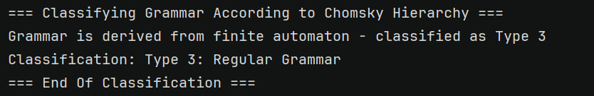
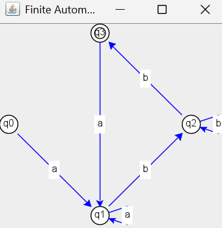

# Laboratory Work #2: Determinism in Finite Automata. Conversion from NDFA 2 DFA. Chomsky Hierarchy.

### Course: Formal Languages & Finite Automata
### Author: Daniela Cebotari, FAF-231
### Variant: 7


----

## Theory

A finite automaton is a mechanism used to represent processes of different kinds. It can be compared to a state machine, as both share similar structures and purposes. The term finite signifies that the automaton has a well-defined starting point and a set of final states, meaning that any process modeled by an automaton has a clear beginning and ending. This structure makes finite automata particularly useful for modeling systems where inputs lead to predictable outcomes, such as language recognition or control systems.

Based on the structure of an automaton, there are cases where a single input symbol can lead to multiple possible states. This introduces non-determinism, where the system’s behavior is not entirely predictable. In systems theory, determinism refers to how predictable a system is. If a system has random variables or multiple possible outcomes for the same input, it becomes non-deterministic or stochastic. Non-deterministic finite automata (NDFAs) are powerful because they can model more complex behaviors, but they can often be converted into deterministic finite automata (DFAs) using algorithms like the subset construction method. This conversion ensures that the system becomes predictable and easier to analyze.

---

## Objectives:

1. Understand what an automaton is and what it can be used for.

2. Continuing the work in the same repository and the same project, the following need to be added:
   a. Provide a function in your grammar type/class that could classify the grammar based on Chomsky hierarchy.

   b. For this you can use the variant from the previous lab.

3. According to your variant number (by universal convention it is register ID), get the finite automaton definition and do the following tasks:

   a. Implement conversion of a finite automaton to a regular grammar.

   b. Determine whether your FA is deterministic or non-deterministic.

   c. Implement some functionality that would convert an NDFA to a DFA.

   d. Represent the finite automaton graphically (Optional, and can be considered as a __*bonus point*__):

    - You can use external libraries, tools or APIs to generate the figures/diagrams.

    - Your program needs to gather and send the data about the automaton and the lib/tool/API return the visual representation.

My variants:

Variant 7:
<br>VN={S, D, E, F, L},
<br>VT={a, b, c, d},
<br>P={
<br>S → aD
<br>D → bE
<br>E → cF
<br>F → dD
<br>E → dL
<br>L → aL
<br>L → bL
<br>L → c
<br>}

Variant 7
<br>Q = {q0,q1,q2,q3},
<br>∑ = {a,b},
<br>F = {q3},
<br>δ(q0,a) = q1,
<br>δ(q1,b) = q2,
<br>δ(q2,b) = q3,
<br>δ(q3,a) = q1,
<br>δ(q2,b) = q2,
<br>δ(q1,a) = q1.

## Implementation description

### Classify the Grammar Based on the Chomsky Hierarchy ###

The classifyGrammar() method in the Grammar class checks the production rules of the grammar and classifies it according to the Chomsky hierarchy. It first assumes the grammar is regular (Type 3) and then checks if the production rules violate the constraints for regular grammars. For example, if a production rule has more than two symbols or contains a non-terminal in an invalid position, the grammar is downgraded to context-free (Type 2). If the grammar allows empty productions (ε) from non-start symbols, it is further downgraded to context-sensitive or unrestricted (Type 1 or 0). This method provides a clear and systematic way to classify grammars, which is essential for understanding their expressive power and complexity.

```java
public String classifyGrammar() {
    boolean isType3 = true; // Regular Grammar
    boolean isType2 = true; // Context-Free Grammar

    for (Map.Entry<Character, List<String>> entry : P.entrySet()) {
        for (String production : entry.getValue()) {
            if (production.length() > 2 || (production.length() == 1 && !VT.contains(production.charAt(0)))) {
                isType3 = false;
            }
            if (production.length() == 0) {
                isType3 = false;
                isType2 = false;
            }
        }
    }

    if (isType3) {
        return "Type 3: Regular Grammar";
    } else if (isType2) {
        return "Type 2: Context-Free Grammar";
    } else {
        return "Type 1: Context-Sensitive Grammar or Type 0: Unrestricted Grammar";
    }
}
```

### Conversion of a Finite Automaton to a Regular Grammar ###

The toRegularGrammar() method in the FiniteAutomaton class converts the automaton into a regular grammar. It maps each state of the automaton to a non-terminal symbol in the grammar. Transitions in the automaton are translated into production rules: for example, a transition δ(q1, a) = q2 becomes a production rule A → aB, where A and B are non-terminals representing q1 and q2, respectively. If a transition leads to a final state, an additional production rule A → a is added. This conversion ensures that the grammar generates the same language as the automaton, demonstrating the close relationship between finite automata and regular grammars.

```java
public Grammar toRegularGrammar() {
    Set<Character> VN = new HashSet<>(); // Non-terminal symbols
    Set<Character> VT = new HashSet<>(Sigma); // Terminal symbols
    Map<Character, List<String>> P = new HashMap<>(); // Production rules
    Character S; // Start symbol

    // Map automaton states to non-terminal symbols
    Map<String, Character> stateToNonTerminal = new HashMap<>();
    char nonTerminalChar = 'S';
    for (String state : Q) {
        stateToNonTerminal.put(state, nonTerminalChar);
        VN.add(nonTerminalChar);
        nonTerminalChar++;
    }

    // Start symbol corresponds to initial state
    S = stateToNonTerminal.get(q0);

    // Create production rules
    for (String state : Q) {
        Character nonTerminal = stateToNonTerminal.get(state);
        List<String> productions = new ArrayList<>();

        if (delta.containsKey(state)) {
            for (Map.Entry<Character, Set<String>> entry : delta.get(state).entrySet()) {
                char symbol = entry.getKey();
                for (String nextState : entry.getValue()) {
                    if (F.contains(nextState)) {
                        productions.add(String.valueOf(symbol)); // A → a
                    } else {
                        productions.add(symbol + String.valueOf(stateToNonTerminal.get(nextState))); // A → aB
                    }
                }
            }
        }

        // Add ε-production for final states
        if (F.contains(state)) {
            productions.add("ε");
        }

        P.put(nonTerminal, productions);
    }

    return new Grammar(VN, VT, P, S);
}
```
### Determining Whether the FA Is Deterministic or Non-Deterministic
The isDeterministic() method in the FiniteAutomaton class checks if the automaton is deterministic by examining its transition function. A deterministic finite automaton (DFA) must have exactly one transition for each symbol from every state. If any state has multiple transitions for the same symbol, the automaton is non-deterministic (NDFA). This method iterates through all states and transitions, ensuring that no state violates the determinism condition. This functionality is crucial for understanding the behavior of the automaton and deciding whether it needs to be converted to a DFA for further processing.
```java
public boolean isDeterministic() {
    for (String state : Q) {
        if (delta.containsKey(state)) {
            for (Map.Entry<Character, Set<String>> entry : delta.get(state).entrySet()) {
                if (entry.getValue().size() > 1) {
                    return false; // Non-deterministic
                }
            }
        }
    }
    return true; // Deterministic
}
```

### Converting an NDFA to a DFA ###
The toDFA() method in the FiniteAutomaton class implements the subset construction algorithm to convert a non-deterministic finite automaton (NDFA) into a deterministic finite automaton (DFA). It starts with the initial state of the NDFA and computes all possible sets of states that can be reached from each state for every input symbol. These sets of states become the new states of the DFA. The method ensures that the DFA has a unique transition for each symbol from every state, making it deterministic. This conversion is essential for simplifying the automaton and enabling efficient processing of input strings.
```java
public FiniteAutomaton toDFA() {
    Set<Set<String>> dfaStates = new HashSet<>(); // DFA states (sets of NDFA states)
    Map<Set<String>, Map<Character, Set<String>>> dfaDelta = new HashMap<>(); // DFA transitions
    Set<String> initialStateSet = new HashSet<>(Collections.singletonList(q0)); // Initial state of DFA
    Set<Set<String>> dfaFinalStates = new HashSet<>(); // Final states of DFA

    // Queue for processing states
    Queue<Set<String>> queue = new LinkedList<>();
    queue.add(initialStateSet);
    dfaStates.add(initialStateSet);

    // Process states
    while (!queue.isEmpty()) {
        Set<String> currentStateSet = queue.poll();

        // Check if current state set contains a final state
        for (String state : currentStateSet) {
            if (F.contains(state)) {
                dfaFinalStates.add(currentStateSet);
                break;
            }
        }

        // Compute transitions for each symbol
        for (char symbol : Sigma) {
            Set<String> nextStateSet = new HashSet<>();
            for (String state : currentStateSet) {
                if (delta.containsKey(state) && delta.get(state).containsKey(symbol)) {
                    nextStateSet.addAll(delta.get(state).get(symbol));
                }
            }

            if (!nextStateSet.isEmpty()) {
                dfaDelta.computeIfAbsent(currentStateSet, k -> new HashMap<>())
                        .put(symbol, nextStateSet);

                if (!dfaStates.contains(nextStateSet)) {
                    dfaStates.add(nextStateSet);
                    queue.add(nextStateSet);
                }
            }
        }
    }

    // Convert sets of states to unique state names
    Map<Set<String>, String> stateSetToName = new HashMap<>();
    int id = 0;
    for (Set<String> stateSet : dfaStates) {
        stateSetToName.put(stateSet, "q" + id++);
    }

    // Build the DFA
    Set<String> dfaQ = new HashSet<>(stateSetToName.values());
    Map<String, Map<Character, String>> dfaTransitions = new HashMap<>();
    for (Map.Entry<Set<String>, Map<Character, Set<String>>> entry : dfaDelta.entrySet()) {
        String fromState = stateSetToName.get(entry.getKey());
        Map<Character, String> transitions = new HashMap<>();
        for (Map.Entry<Character, Set<String>> transition : entry.getValue().entrySet()) {
            transitions.put(transition.getKey(), stateSetToName.get(transition.getValue()));
        }
        dfaTransitions.put(fromState, transitions);
    }

    String dfaInitialState = stateSetToName.get(initialStateSet);
    Set<String> dfaF = new HashSet<>();
    for (Set<String> finalStateSet : dfaFinalStates) {
        dfaF.add(stateSetToName.get(finalStateSet));
    }

    return new FiniteAutomaton(dfaQ, Sigma, dfaTransitions, dfaInitialState, dfaF);
}
```
### Representing the Finite Automaton Graphically ###
The AutomatonVisualizer class uses JGraphT to create a graphical representation of the automaton. It constructs a directed graph where nodes represent states and edges represent transitions. The graph is displayed in a window using JGraphXAdapter, with states drawn as circles and final states highlighted with double circles. The layout is organized using a circular layout algorithm, making the automaton easy to visualize and understand. This graphical representation provides an intuitive way to explore the structure of the automaton and verify its correctness.
```java
public void visualize() {
    // Create a directed graph
    Graph<String, DefaultEdge> graph = new DefaultDirectedGraph<>(DefaultEdge.class);

    // Add states as vertices
    for (String state : states) {
        graph.addVertex(state);
    }

    // Add transitions as edges
    for (String state : states) {
        if (transitions.containsKey(state)) {
            for (Map.Entry<Character, Set<String>> entry : transitions.get(state).entrySet()) {
                char symbol = entry.getKey();
                for (String nextState : entry.getValue()) {
                    graph.addEdge(state, nextState);
                }
            }
        }
    }

    // Visualize the graph using JGraphX
    JGraphXAdapter<String, DefaultEdge> graphAdapter = new JGraphXAdapter<>(graph);

    // Apply a layout (e.g., circular layout)
    mxCircleLayout layout = new mxCircleLayout(graphAdapter);
    layout.execute(graphAdapter.getDefaultParent());

    // Create a JFrame to display the graph
    JFrame frame = new JFrame("Finite Automaton Visualization");
    frame.setDefaultCloseOperation(JFrame.EXIT_ON_CLOSE);

    // Add the graph to the frame
    mxGraphComponent graphComponent = new mxGraphComponent(graphAdapter);
    frame.getContentPane().add(graphComponent);

    // Display the frame
    frame.pack();
    frame.setLocationRelativeTo(null); // Center the window
    frame.setVisible(true);
}
```

## Conclusions, Screenshots, Results
One of the key takeaways from this work was the importance of understanding the structure and behavior of finite automata. The implementation of tasks like grammar classification, automaton conversion, and graphical representation taught me how to break down complex systems into smaller, manageable components. For example, the classifyGrammar() method demonstrated how to analyze production rules and determine the type of grammar, while the toDFA() method showed how to simplify non-deterministic systems into deterministic ones using the subset construction algorithm.

### Determining Whether the FA Is Deterministic or Non-Deterministic


### Converting an NDFA to a DFA


### Conversion of a Finite Automaton to a Regular Grammar


### Classify the Grammar Based on the Chomsky Hierarchy


### Finite Automaton Graphically:
Here is how the output looks like:


## References
1. [Cretu Dumitru and Vasile Drumea, Irina Cojuhari. DSL_laboratory_works Repository](https://github.com/filpatterson/DSL_laboratory_works)
2. [Hopcroft E. and others. Introduction to Automata Theory, Languages and Computation](https://www-2.dc.uba.ar/staff/becher/Hopcroft-Motwani-Ullman-2001.pdf)
2. [Peter Linz. Formal Languages and Automata](https://broman.dev/download/An%20Introduction%20to%20Formal%20Languages%20and%20Automata%206th%20Edition.pdf)
3. [Pitts M. Andrew. Regular Languages and Finite Automata](https://www.cl.cam.ac.uk/teaching/1213/RLFA/reglfa-notes.pdf)
4. [Finite automata. Part 1](https://drive.google.com/file/d/1rBGyzDN5eWMXTNeUxLxmKsf7tyhHt9Jk/view)