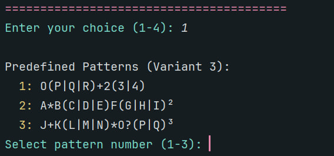

# Laboratory Work #4: Regular Expressions

### Course: Formal Languages & Finite Automata
### Author: Daniela Cebotari, FAF-231
### Professors: Cretu Dumitru, Irina Cojuhari

----

## Theory

Regular expressions (regex) are powerful tools for pattern matching and text manipulation. They provide a concise and flexible means to match strings of text, such as particular characters, words, or patterns of characters. Regular expressions are used in many programming languages and tools for tasks like validation, searching, and text processing.

A regular expression is a sequence of characters that forms a search pattern. It can be used to check if a string contains the specified search pattern. Regular expressions are built using a combination of literal characters and special characters (metacharacters) that have special meanings.

## Objectives:

1. Write and cover what regular expressions are, what they are used for;
2. Below you will find 3 complex regular expressions per each variant. Take a variant depending on your number in the list of students and do the following:

    1. Write a code that will generate valid combinations of symbols conform given regular expressions (examples will be shown). Be careful that idea is to interpret the given regular expressions dinamycally, not to hardcode the way it will generate valid strings. You give a set of regexes as input and get valid word as an output 
   2. In case you have an example, where symbol may be written undefined number of times, take a limit of 5 times (to evade generation of extremely long combinations); 
   3. **Bonus point:** write a function that will show sequence of processing regular expression (like, what you do first, second and so on)

Write a good report covering all performed actions and faced difficulties.

## Implementation Description

For this laboratory work, I implemented a regex pattern generator that can parse and generate strings matching given regular expressions. The implementation consists of two main components: a regex parser and a string generator. The parser converts regex patterns into an abstract syntax tree (AST), and the generator uses this AST to create valid strings matching the pattern.

### Project Structure

The project is separated into two main files:
- `RegexParser.py` - Contains the core parser and generator implementation
- `Main.py` - Interactive program with a menu-driven interface

### Core Components

I designed several key classes to represent different regex components. Each class inherits from the base `RegexNode` class and implements the `generate()` method to produce strings matching the pattern:

```python
class RegexNode:
    # As the base class for all regex components in the AST,
    # I defined the interface that all regex nodes must implement
    def generate(self, log=None):
        raise NotImplementedError("generate() must be implemented by subclasses")

class Literal(RegexNode):
    # I implemented this class to handle single characters in the regex pattern
    # For example, 'A' in the pattern 'A+B'
    def __init__(self, char):
        self.char = char  # The actual character to be generated

    def generate(self, log=None):
        # I made it simply return the character and log the action if logging is enabled
        if log is not None:
            log.append(f"-> appending literal '{self.char}'")
        return self.char

class Sequence(RegexNode):
    # I created this class to handle sequences of regex components that must appear in order
    # For example, 'AB' in the pattern 'AB+C'
    def __init__(self, children):
        self.children = children  # List of RegexNode instances

    def generate(self, log=None):
        result = ""
        if log is not None:
            log.append(f"-> entering sequence ({len(self.children)} items)")
        # I implemented sequential generation of each child
        for child in self.children:
            result += child.generate(log)
        return result

class Choice(RegexNode):
    # I designed this class to handle alternatives in the pattern (| operator)
    # For example, '(A|B)' in the pattern '(A|B)+C'
    def __init__(self, children):
        self.children = children  # List of possible alternatives

    def generate(self, log=None):
        # I implemented random selection of alternatives
        chosen_child = random.choice(self.children)
        if log is not None:
            log.append(f"-> entering choice: choosing {chosen_child}")
        return chosen_child.generate(log)

class Repeat(RegexNode):
    # I created this class to handle repetition quantifiers (+, *, ?, ², ³)
    # For example, 'A+' in the pattern 'A+B'
    def __init__(self, child, min_rep, max_rep):
        self.child = child      # The pattern to repeat
        self.min_rep = min_rep  # Minimum number of repetitions
        self.max_rep = max_rep  # Maximum number of repetitions
```

### Parser Implementation

A recursive descent parser that processes the input string character by character, building the AST from the bottom up:

```python
class RegexParser:
    def __init__(self, regex_string):
        self.regex = regex_string  # The input regex pattern
        self.pos = 0               # Current position in the string

    def parse(self):
        # I designed the main entry point for parsing
        if self.pos == len(self.regex):
            raise ValueError("parser error: input regex string is empty.")
        
        # I implemented parsing starting with choices (highest precedence)
        ast = self._parse_choice()
        
        # I added validation to ensure the entire input is consumed
        if self.pos != len(self.regex):
            raise ValueError(f"parser error: unexpected character '{self._peek()}'")
        return ast

    def _parse_choice(self):
        # I implemented parsing of alternatives separated by '|'
        # For example, 'A|B|C' becomes a Choice node with three children
        choices = [self._parse_sequence()]
        while self._peek() == '|':
            self._consume('|')
            choices.append(self._parse_sequence())
        return Choice(choices) if len(choices) > 1 else choices[0]

    def _parse_sequence(self):
        # I implemented parsing of sequences of terms
        # For example, 'AB' becomes a Sequence node with two Literal children
        terms = []
        while self._peek() is not None and self._peek() not in ('|', ')'):
            terms.append(self._parse_term())
        return Sequence(terms) if len(terms) > 1 else terms[0]

    def _parse_term(self):
        # I implemented parsing of atoms potentially followed by quantifiers
        # For example, 'A+' becomes a Repeat node with a Literal child
        atom = self._parse_atom()
        quantifier = self._parse_quantifier()
        if quantifier:
            min_rep, max_rep = quantifier
            return Repeat(atom, min_rep, max_rep)
        return atom
```

### String Generation

The string generation process through the `process_pattern` function:

```python
def process_pattern(pattern_string):
    print(f"Processing Pattern: {pattern_string}")
    try:
        # 1. I implemented parsing the regex string into an AST
        # This creates a tree of RegexNode objects representing the pattern
        ast_root = parse_regex(pattern_string)
        
        # 2. I implemented generating a random string using the AST
        # The log list stores the generation steps for visualization
        generation_log = []
        generated_string = ast_root.generate(log=generation_log)
        
        # 3. I implemented printing the results
        print(f"Generated String: \"{generated_string}\"")
        print("Generation Process Log:")
        # I added logging of each step in the generation process
        for step in generation_log:
            print(f"  {step}")
    except Exception as e:
        print(f"Error processing pattern: {e}")
```

## Conclusions, Screenshots, Results


The main menu of the program, showing the four available options:
1. Generate from a specific predefined pattern
2. Generate from all predefined patterns
3. Generate from a custom regex pattern
4. Exit
The menu uses colored text for better readability and user experience.

When using option 1, the program displays the list of predefined patterns for Variant 3:



After selecting the pattern, the program processes it in three steps:
1. Parsing the pattern into an abstract syntax tree
2. Generating a random string that matches the pattern
3. Displaying the results and generation process log


For the bonus point, it shows the detailed generation process log, which includes:
- The sequence of operations performed
- The choices made at each step
- The final generated string
This log helps understand how the pattern is processed and how the final string is constructed.


When using the custom pattern option (option 3), the program provides helpful syntax hints:


It supports various regex features:
- Literals (A-Z, 0-9)
- Sequences (concatenation)
- Choices (| operator)
- Quantifiers (+, *, ?, ², ³)

## Conclusions

Through this laboratory work, I've gained a deeper understanding of regular expressions and their implementation. The project demonstrates how regex patterns can be parsed and used to generate valid strings, which is useful for testing and validation purposes.

What gave I gained?
1. Regular expressions can be represented as abstract syntax trees
2. Recursive descent parsing is an effective way to parse regex patterns
3. String generation can be implemented by traversing the AST
4. Logging the generation process helps understand how patterns are processed

## References:
1. [Cretu Dumitru and Vasile Drumea, Irina Cojuhari. DSL_laboratory_works Repository](https://github.com/filpatterson/DSL_laboratory_works)
2. [Regular Expressions](https://en.wikipedia.org/wiki/Regular_expression)
3. [Recursive Descent Parsing](https://en.wikipedia.org/wiki/Recursive_descent_parser)